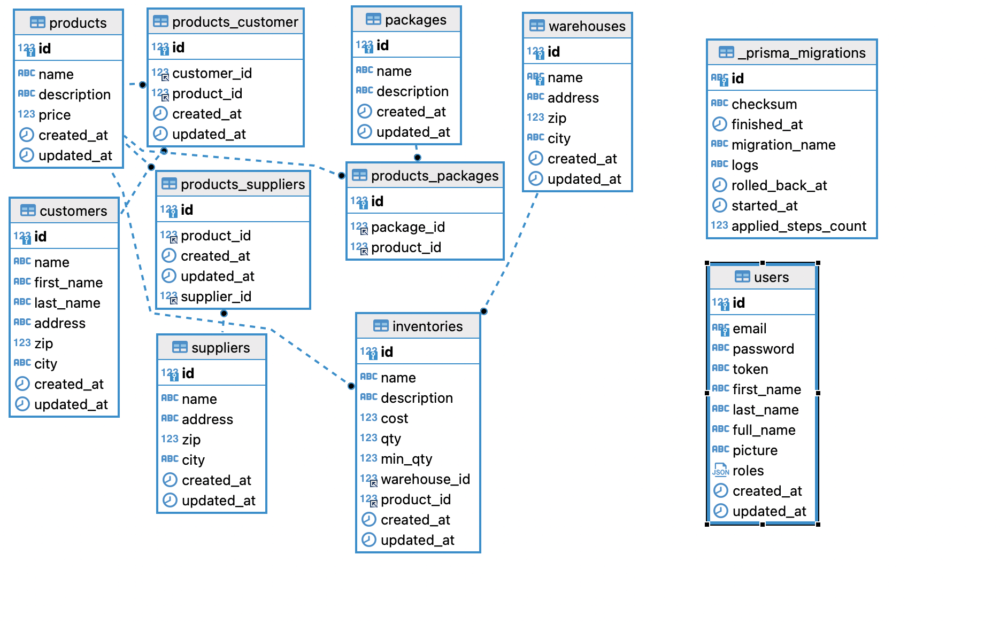

# mini-erp
Mini and rather simplified ERP api which should administer customers, products, inventories, warehoses

## Instalation

```bash
docker-compose build
```

```bash
docker-compose up -d
```

```bash
docker-compose exec -it erp.server bash
```

```bash
npx prisma generate
```

```bash
npx prisma migrate dev
```

```bash
npx prisma db seed
```

To seed the initial dev data.



Backend will run on http://localhost:3010


## Available API Endpoints

Test user:

email: test@gmail.com, password: test1234

```
/api/auth/register, POST
```

```
/api/auth/login, POST
```

```
/api/auth/profile, GET
```

```
/api/users, GET
```

```
/api/customers, POST
```
```
/api/customers/:id, GET
```
```
/api/customers, GET
```
```
/api/customers/:id, PATCH
```
```
/api/customers/:id, DELETE
```
```
/api/suppliers, POST
```
```
/api/suppliers/:id, GET
```
```
/api/suppliers, GET
```
```
/api/suppliers/:id, PATCH
```
```
/api/suppliers/:id, DELETE
```
```
/api/warehouses, POST
```
```
/api/warehouses, POST
```
```
/api/warehouses/:id, GET
```
```
/api/warehouses, GET
```
```
/api/warehouses/:id, PATCH
```
```
/api/warehouses/:id, DELETE
```
```
/api/packages, POST
```
```
/api/packages/:id, GET
```
```
/api/packages, GET
```
```
/api/packages/:id, PATCH
```
```
/api/packages/:id, DELETE
```
```
/api/products, POST
```
```
/api/products/:id, GET
```
```
/api/products, GET
```
```
/api/products/:id, PATCH
```
```
/api/products/:id, DELETE
```
```
/api/inventories, POST
```
```
/api/inventories/:id, GET
```
```
/api/inventories, GET
```
```
/api/inventories/:id, PATCH
```
```
/api/inventories/:id, DELETE
```
```
/api/reports/widgets, GET, query params: {product_id, customer_id, supplier_id, warehouse_id}
```
